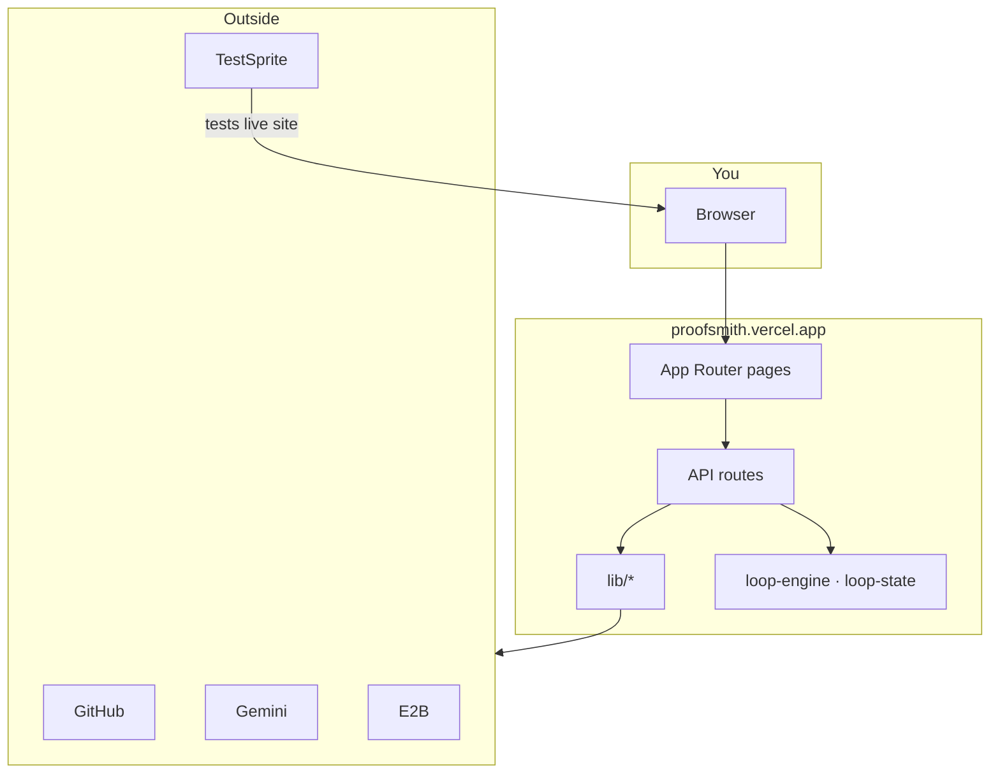
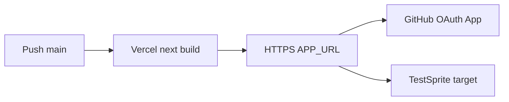
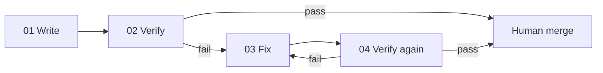
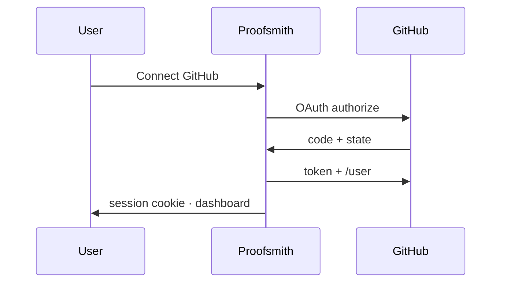
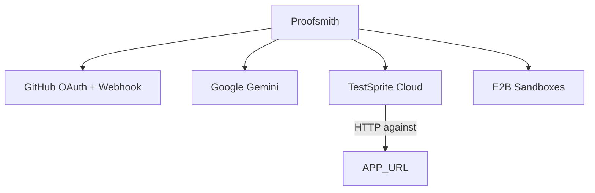
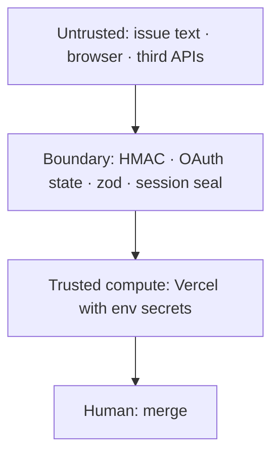

<p align="center">
  <strong>PROOFSMITH</strong><br/>
  <em>Issue in. Verified PR out.</em>
</p>

<p align="center">
  <a href="https://proofsmith.vercel.app">Live app</a> ·
  <a href="https://github.com/SahilRakhaiya05/proofsmith">GitHub</a> ·
  <a href="./docs/ARCHITECTURE.md">Architecture</a> ·
  <a href="./LOOP.md">LOOP.md</a> ·

</p>

<p align="center">
  <strong>Maker</strong> = Google Gemini &nbsp;·&nbsp;
  <strong>Checker</strong> = <a href="https://github.com/TestSprite/testsprite-cli">TestSprite CLI</a> &nbsp;·&nbsp;
  <strong>Merge</strong> = human only
</p>

---

Proofsmith is a **GitHub-native autonomous engineering loop**. A coding agent ships the smallest fix; an **independent** checker runs real tests against the **live** deployed URL; failures feed the maker; passes bank into evidence. The loop does not stop when the code “looks done.”

> A loop with no real checker doesn't fail loudly. It hallucinates progress.

| | |
|--|--|
| **Live** | https://proofsmith.vercel.app |
| **Repo** | https://github.com/SahilRakhaiya05/proofsmith |
| **Stack** | Next.js 16 · React 19 · TypeScript · Vercel · Node 22 |
| **License** | MIT |

---

## Table of contents (A–Z)

| | | |
|--|--|--|
| [A — About](#a--about) | [B — Build & run](#b--build--run) | [C — Commands & scripts](#c--commands--scripts) |
| [D — Deploy](#d--deploy-vercel) | [E — Environment](#e--environment-variables) | [F — Four-step loop](#f--four-step-loop) |
| [G — GitHub integration](#g--github-integration) | [H — Health & launch](#h--health--launch) | [I — Integrations map](#i--integrations-map) |
| [J — Judge / submit](#j--judge--submit) | [K — Key principles](#k--key-principles) | [L — LOOP.md & lessons](#l--loopmd--lessons) |
| [M — Modules (repo map)](#m--modules-repo-map) | [N — Navigation (UI)](#n--navigation-ui-routes) | [O — OAuth setup](#o--oauth-setup) |
| [P — Packages](#p--packages-loop-core) | [Q — Quality gates](#q--quality-gates) | [R — REST API index](#r--rest-api-index) |
| [S — Security](#s--security) | [T — TestSprite checker](#t--testsprite-checker) | [U — Use cases](#u--use-cases) |
| [V — Verification evidence](#v--verification-evidence) | [W — Workflows CI](#w--workflows-ci) | [X — eXtensions / agents](#x--extensions--agents) |
| [Y — Your first 15 minutes](#y--your-first-15-minutes) | [Z — Zero-trust posture](#z--zero-trust-posture) | |

**Deep dives:** [docs/ARCHITECTURE.md](./docs/ARCHITECTURE.md) · [docs/API.md](./docs/API.md) · [docs/DEPLOYMENT.md](./docs/DEPLOYMENT.md) · [docs/ENVIRONMENT.md](./docs/ENVIRONMENT.md) · [docs/TESTING.md](./docs/TESTING.md)

---

## A — About

### Problem

One-shot coding agents produce PRs. They rarely produce **falsifiable evidence** that the user-visible bug is gone on a **deployed** URL.

### Solution

| Layer | Job |
|-------|-----|
| **Contract** | Issue becomes acceptance criteria (sticky comment) |
| **Maker** | Gemini (server-ranked model) plans/fixes |
| **Checker** | TestSprite CLI against `APP_URL` |
| **Human** | Merge only after independent green + policy |

### What ships in this repo

- Full Next.js product UI (dashboard, AI chat, launch, security scorecard, submit pack)
- Signed GitHub webhook boundary + OAuth identity
- Gemini maker/triage/reviewer with **server-side best model** (no client model shopping)
- TestSprite facade + three schema-valid plans
- E2B sandbox create/kill
- Strict loop state machine (`packages/loop-state`)
- Pre-launch security scorecard (grade A–F)

---

## B — Build & run

### Prerequisites

- Node.js **22.x** (see [`.nvmrc`](./.nvmrc))
- npm 10+
- Optional: global `@testsprite/testsprite-cli`

### Install

```bash
git clone https://github.com/SahilRakhaiya05/proofsmith.git
cd proofsmith
npm ci
cp .env.example .env.local   # never commit secrets
```

### Dev / test / production build

```bash
npm run dev       # http://localhost:3000
npm test          # vitest
npm run build     # next build
npm start         # next start
```

### Architecture snapshot



Full diagrams: **[docs/ARCHITECTURE.md](./docs/ARCHITECTURE.md)**

---

## C — Commands & scripts

| Script | Purpose |
|--------|---------|
| `npm run dev` | Next dev server `:3000` |
| `npm run build` | Production `next build` |
| `npm start` | Serve production build |
| `npm test` | Vitest unit suite |
| `npm run typecheck` | `tsc --noEmit` |
| `npm run lint` | ESLint |
| `npm run db:generate` | Drizzle kit generate |
| `npm run dev:vinext` / `build:vinext` | Legacy Sites/vinext path only |

**Do not use vinext for Vercel.** Default build is Next.js.

---

## D — Deploy (Vercel)

1. Import **SahilRakhaiya05/proofsmith** · branch `main`.
2. Framework **Next.js** · Build `npm run build` · Node **22.x**.
3. Set env from [`.env.example`](./.env.example) (Production + Preview).
4. Set `APP_URL=https://proofsmith.vercel.app` (or your domain).
5. GitHub OAuth callback:  
   `https://proofsmith.vercel.app/api/auth/github/callback`
6. Redeploy without cache if an old build fails.

Guide: [docs/DEPLOYMENT.md](./docs/DEPLOYMENT.md)



---

## E — Environment variables

| Variable | Required | Purpose |
|----------|----------|---------|
| `APP_URL` | Prod | Public origin (OAuth + checker target) |
| `GITHUB_CLIENT_ID` | Yes | OAuth app |
| `GITHUB_CLIENT_SECRET` | Yes | OAuth secret |
| `SESSION_SECRET` | Yes | AES-GCM sessions (≥32 chars) |
| `TESTSPRITE_API_KEY` | Yes for banked pass | Checker cloud |
| `TESTSPRITE_PROJECT_ID` | Optional | Default project |
| `GEMINI_API_KEY` | Yes for AI | Maker LLM (aliases: `GOOGLE_API_KEY`, …) |
| `GEMINI_MODEL` | No | Hard pin; else server auto-ranks |
| `E2B_API_KEY` | No | Sandboxes |
| `GITHUB_WEBHOOK_SECRET` | For webhooks | HMAC |
| `PROOFSMITH_GITHUB_TOKEN` | For sticky comments | Worker token |

Full encyclopedia: [docs/ENVIRONMENT.md](./docs/ENVIRONMENT.md) · example: [`.env.example`](./.env.example)

**Secrets never appear in** `/api/health`, `/settings`, or scorecard JSON.

---

## F — Four-step loop

| Step | Role | What happens |
|------|------|----------------|
| **01 Write** | Maker | Gemini ships plan/code |
| **02 Verify** | Checker | TestSprite vs live URL |
| **03 Fix** | Maker | Reads failure bundle |
| **04 Verify again** | Checker | Rerun; pass banks to LOOP.md |



In-app guide: [`/loop`](https://proofsmith.vercel.app/loop)

---

## G — GitHub integration

| Feature | Route / component |
|---------|-------------------|
| OAuth login | `GET /api/auth/github` → callback → encrypted session cookie |
| Identity UI | `GitHubIdentity` |
| Repos / issues | `/api/github/repos`, `/api/github/issues` (session required) |
| Commands | Issue comment `/proofsmith start\|status\|verify|…` |
| Webhook | `POST /api/github/webhook` (HMAC + trust + grammar) |



---

## H — Health & launch

| Endpoint | Use |
|----------|-----|
| `GET /api/health` | Flags, env checklist, endpoints |
| `GET\|POST /api/launch` | One-click preflight |
| `GET /api/security/scorecard` | Grade A–F weighted checks |
| UI `/launch` · `/security` | Same, visual |

```bash
curl -s https://proofsmith.vercel.app/api/health | jq .integrations
curl -s https://proofsmith.vercel.app/api/launch | jq .ready,.scorecard
```

---

## I — Integrations map



| Integration | Library | UI |
|-------------|---------|-----|
| GitHub | `lib/github-session.ts`, `github-user.ts` | `/dashboard` |
| Gemini | `lib/gemini.ts` | `/ai` |
| TestSprite | `lib/testsprite-client.ts` | `/integrations` |
| E2B | `lib/e2b-client.ts` | Dashboard sandbox button |
| Scorecard | `lib/security-scorecard.ts` | `/security` |

---

## J — Judge / submit

Season 3 checklist:

1. Public repo + live URL  
2. Agent-written [LOOP.md](./LOOP.md)  
3. README with product + evidence links  
4. Discord registration post  

Pack: [SUBMISSION.md](./SUBMISSION.md) · UI: [`/submit`](https://proofsmith.vercel.app/submit)

**Discord blurb (edit URL if needed):**

```
**Proofsmith** — Issue in. Verified PR out.
Repo: https://github.com/SahilRakhaiya05/proofsmith
Live: https://proofsmith.vercel.app
LOOP.md: https://github.com/SahilRakhaiya05/proofsmith/blob/main/LOOP.md
Maker: Gemini (server auto model) · Checker: TestSprite CLI
/launch · /security · /ai · /dashboard
```

---

## K — Key principles

1. **Checker ≠ maker** — TestSprite is independent.  
2. **Live URL only** — no “tests passed locally” as banked proof.  
3. **Illegal shortcuts** — state machine forbids `BUILDING → SUCCESS`.  
4. **Human merge** — automation stops at `AWAITING_HUMAN`.  
5. **Fail closed** — missing secrets degrade; they do not fake green.  
6. **No secret leakage** — APIs return booleans.  
7. **Server-auto models** — users never pick Gemini models from a list.

---

## L — LOOP.md & lessons

- **[LOOP.md](./LOOP.md)** — one plain-English line per iteration (maker → what ran → broke → fixed). Judges read this first.  
- **[LESSONS.md](./LESSONS.md)** — banked lessons after verified passes.  
- Theater on `/` is a **labelled fixture**, not claimed cloud evidence.

---

## M — Modules (repo map)

```
app/                 UI + API (Next App Router)
lib/                 Server integrations (gemini, testsprite, e2b, oauth, scorecard)
packages/loop-engine Commands, contracts, sticky comment renderer
packages/loop-state  Legal transition table
apps/release-lab     Deterministic reference app for plans
.testsprite/plans    Checker plans
.proofsmith/         Policy + budgets
.github/workflows    CI quality + loop templates
tests/               Vitest
docs/                Architecture, API, deploy, env, testing
```

---

## N — Navigation (UI routes)

| Path | Purpose |
|------|---------|
| `/` | Hero, four steps, Loop Theater fixture, ReleaseLab |
| `/dashboard` | Live GitHub / TestSprite / E2B / Gemini board |
| `/ai` | Gemini chat (triage · maker · reviewer) |
| `/launch` | One-click pre-launch |
| `/security` | Security scorecard |
| `/submit` | Judge pack |
| `/loop` | Four-step + submit guide |
| `/loops` | Run ledger · start from issues |
| `/agents` | Agent roster |
| `/settings` | Env checklist |
| `/integrations` | Wire credentials (no values shown) |

---

## O — OAuth setup

1. GitHub → Settings → Developer settings → **OAuth Apps** → New.  
2. Homepage: `https://proofsmith.vercel.app`  
3. Callback: `https://proofsmith.vercel.app/api/auth/github/callback`  
4. Copy Client ID + Secret → Vercel env.  
5. Set `SESSION_SECRET` to a long random string.  
6. Set `APP_URL=https://proofsmith.vercel.app`.  

**Bug fixed in `7e1ac20`:** Set-Cookie on immutable `Response.redirect` caused production **500** — now uses `lib/http-redirect.ts`.

---

## P — Packages (loop core)

### `packages/loop-engine`

- `parseCommand("/proofsmith start")`  
- `LoopContract` schema  
- `isTrustedAssociation`  
- `renderContractComment` sticky body  

### `packages/loop-state`

- Full state list + terminal states  
- `transition()` / `canTransition()`  
- **Illegal:** `BUILDING → SUCCESS`  

Diagrams: [docs/ARCHITECTURE.md §8](./docs/ARCHITECTURE.md#8-loop-state-machine)

---

## Q — Quality gates

```bash
npm test          # unit
npm run build     # production compile
npm run typecheck # optional
npm run lint      # optional
```

CI template: `.github/workflows/quality.yml` (lint, typecheck, test, build, secret scan).

---

## R — REST API index

| Method | Path | Auth |
|--------|------|------|
| GET | `/api/health` | Public |
| GET/POST | `/api/launch` | Public |
| GET | `/api/security/scorecard` | Public |
| GET | `/api/auth/github` | Public → GitHub |
| GET | `/api/auth/github/callback` | OAuth |
| GET | `/api/auth/me` | Cookie |
| POST | `/api/auth/logout` | Cookie |
| GET | `/api/github/repos` | Session |
| GET | `/api/github/issues` | Session |
| POST | `/api/github/webhook` | HMAC |
| GET | `/api/ai/status` · `/models` | Public flags |
| POST | `/api/ai/agent` | Server Gemini |
| GET/POST | `/api/loop/runs` | POST needs session |
| POST | `/api/loop/iterate` | Maker iteration |
| GET/POST | `/api/testsprite/*` | API key server-side |
| GET/POST/DELETE | `/api/e2b/*` | API key server-side |
| GET | `/api/agents` · `/api/dashboard/summary` | Mixed |

Full schemas: [docs/API.md](./docs/API.md)

---

## S — Security

| Control | Detail |
|---------|--------|
| Session | AES-GCM sealed cookie, HttpOnly, Secure on HTTPS |
| OAuth CSRF | `ps_oauth_state` cookie |
| Webhook | SHA-256 HMAC, constant-time compare |
| Agents | No merge authority |
| APIs | Never return secret material |
| Scorecard | Critical gates for launch readiness |

Report issues: [SECURITY.md](./SECURITY.md)

---

## T — TestSprite checker

Official CLI: https://github.com/TestSprite/testsprite-cli

```bash
npm i -g @testsprite/testsprite-cli
testsprite setup
testsprite test create \
  --plan-from .testsprite/plans/viewer-approval.plan.json \
  --run --wait \
  --target-url https://proofsmith.vercel.app
```

In-app probes: `/api/testsprite/status` · plans under `.testsprite/plans/`.

**Bank a pass** only after a live run, then append a line to [LOOP.md](./LOOP.md).

---

## U — Use cases

1. **Hackathon loop demo** — `/launch` → `/ai` → TestSprite → LOOP.md  
2. **Release auth bug** — ReleaseLab viewer-approval scenario  
3. **Repo operator** — Connect GitHub → list issues → start loop run  
4. **Security review** — `/security` grade before claiming readiness  
5. **Judge review** — `/submit` + LOOP.md + live URL in 90 seconds  

---

## V — Verification evidence

| Evidence type | Where |
|---------------|--------|
| Local unit | `npm test` |
| Production build | `npm run build` |
| OAuth configured | `/api/health` → `githubOAuth: true` |
| Gemini live | `/ai` chat · server-auto model |
| Checker banked | TestSprite dashboard + LOOP.md line |
| Security grade | `/security` |

**Truth status (honest):**

| Claim | Status |
|-------|--------|
| App deployed | https://proofsmith.vercel.app |
| Unit + build | Green on main |
| OAuth | Fixed redirect cookies; works when env set |
| Live TestSprite banked pass | Claim only after you run it and log LOOP.md |

---

## W — Workflows (CI)

| Workflow | Role |
|----------|------|
| `quality.yml` | Lint, typecheck, test, build, secret scan |
| `proofsmith-loop.yml` | Dispatch for `/proofsmith start` |
| `testsprite-preview.yml` | Preview checker gate |
| `production-verify.yml` | Production verification gate |

---

## X — eXtensions / agents

Roster (`lib/agents-catalog.ts`): Triage · Contract · Maker · Gemini Orchestrator · Local Checker · Preview · TestSprite · Reviewer · Challenger · Production · Memory.

All: **`canApproveMerge: false`**.

UI: [`/agents`](https://proofsmith.vercel.app/agents)

---

## Y — Your first 15 minutes

| Min | Action |
|-----|--------|
| 0–2 | Open https://proofsmith.vercel.app |
| 2–4 | `/launch` → Run pre-launch |
| 4–6 | `/security` → read grade |
| 6–10 | `/ai` → “Propose fix for viewer approval bypass” |
| 10–12 | `/dashboard` → Connect GitHub (if OAuth set) |
| 12–15 | Skim [LOOP.md](./LOOP.md) + [docs/ARCHITECTURE.md](./docs/ARCHITECTURE.md) |

Then: run TestSprite against the live URL and bank Iteration N+1.

---

## Z — Zero-trust posture



- Issue bodies are **data**, never shell.  
- Webhook commands are **grammar-checked tokens**.  
- Checker is **outside** the maker process.  
- Merge is **outside** automation.

---

## Documentation index

| Doc | Description |
|-----|-------------|
| [docs/ARCHITECTURE.md](./docs/ARCHITECTURE.md) | Full system design + Mermaid diagrams A–Z |
| [docs/API.md](./docs/API.md) | REST reference |
| [docs/DEPLOYMENT.md](./docs/DEPLOYMENT.md) | Vercel + OAuth + checker |
| [docs/ENVIRONMENT.md](./docs/ENVIRONMENT.md) | Env vars |
| [docs/TESTING.md](./docs/TESTING.md) | Vitest + TestSprite |
| [docs/README.md](./docs/README.md) | Docs hub |
| [LOOP.md](./LOOP.md) | Iteration log |
| [SUBMISSION.md](./SUBMISSION.md) | Season 3 pack |
| [SECURITY.md](./SECURITY.md) | Security policy |
| [ARCHITECTURE.md](./ARCHITECTURE.md) | Short pointer (see docs/) |

---

## License

MIT. Third-party notices: [THIRD_PARTY_NOTICES.md](./THIRD_PARTY_NOTICES.md).

---

<p align="center">
  <strong>Issue in. Verified PR out.</strong><br/>
  Built so the checker can say no.
</p>
