# Proofsmith Architecture

**Version:** 0.3 · **Stack:** Next.js 16 (App Router) · React 19 · TypeScript · Vercel  
**Repo:** https://github.com/SahilRakhaiya05/proofsmith · **Live:** https://proofsmith.vercel.app

This document is the system design reference: context, components, data flows, state machine, agents, security, and deployment topology.

---

## Table of contents

1. [Design principles](#1-design-principles)
2. [System context](#2-system-context)
3. [High-level container diagram](#3-high-level-container-diagram)
4. [Repository map](#4-repository-map)
5. [Request lifecycle](#5-request-lifecycle)
6. [Maker–checker loop](#6-makerchecker-loop)
7. [Four-step sequence](#7-four-step-sequence)
8. [Loop state machine](#8-loop-state-machine)
9. [GitHub OAuth sequence](#9-github-oauth-sequence)
10. [Webhook command pipeline](#10-webhook-command-pipeline)
11. [Gemini model selection](#11-gemini-model-selection)
12. [TestSprite checker path](#12-testsprite-checker-path)
13. [E2B sandbox path](#13-e2b-sandbox-path)
14. [Agent roster](#14-agent-roster)
15. [Security boundaries](#15-security-boundaries)
16. [Pre-launch scorecard](#16-pre-launch-scorecard)
17. [Data stores](#17-data-stores)
18. [API surface map](#18-api-surface-map)
19. [Deployment topology](#19-deployment-topology)
20. [Failure modes](#20-failure-modes)
21. [Related docs](#21-related-docs)

---

## 1. Design principles

| # | Principle | How it is enforced |
|---|-----------|-------------------|
| P1 | **Independent checker** | TestSprite hits live `APP_URL`, never trusts maker self-grade |
| P2 | **No hallucinated progress** | Illegal transitions throw; `BUILDING → SUCCESS` is impossible |
| P3 | **Human merge gate** | All agents: `canApproveMerge: false` |
| P4 | **Secrets stay server-side** | Health/settings/scorecard return booleans only |
| P5 | **Server-auto AI** | Gemini ranked in `lib/gemini.ts`; no client model catalog |
| P6 | **Signed command boundary** | Webhook HMAC + trusted association + command grammar |
| P7 | **Evidence is commit-bound** | Pass for SHA N is stale for SHA N+1 |
| P8 | **Fail closed** | Missing secrets → 503 / degraded, not silent success |

---

## 2. System context

Who talks to Proofsmith, and who Proofsmith talks to.

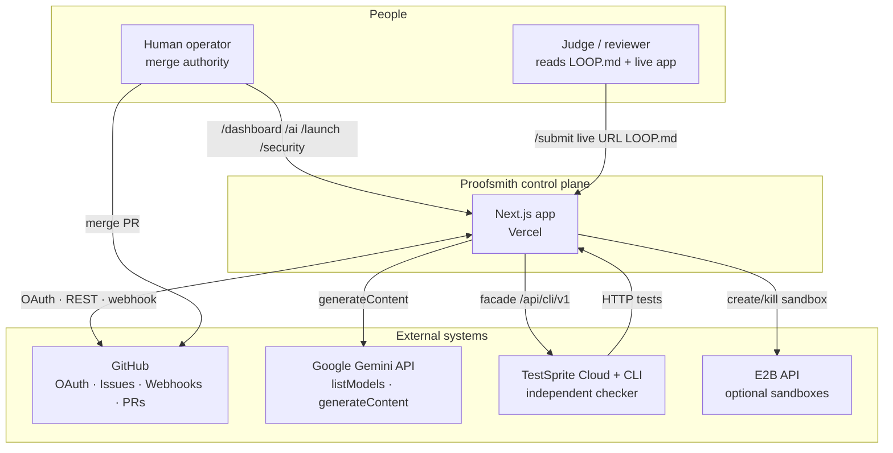

---

## 3. High-level container diagram

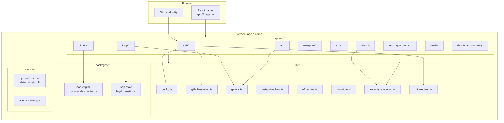

---

## 4. Repository map

```
proofsmith/
├── app/                          # Next.js App Router
│   ├── page.tsx                  # Marketing + four steps + Loop Theater
│   ├── layout.tsx · globals.css
│   ├── ai/                       # Gemini chat console
│   ├── agents/                   # Agent roster UI
│   ├── dashboard/                # Integration board
│   ├── launch/                   # One-click preflight
│   ├── security/                 # Scorecard UI
│   ├── submit/                   # Judge pack UI
│   ├── loop/ · loops/            # Four-step guide + run ledger
│   ├── settings/ · integrations/
│   ├── components/AppShell.tsx
│   └── api/                      # REST (see §18)
├── lib/                          # Server-only integrations
├── packages/
│   ├── loop-engine/              # parseCommand, contracts, sticky comments
│   └── loop-state/               # transition() legal table
├── apps/release-lab/             # Reference app for TestSprite plans
├── .testsprite/plans/            # viewer-approval · exact-once · rollback
├── .proofsmith/                  # policy.yml · config.yml
├── .github/workflows/            # quality · loop · testsprite · production
├── tests/                        # Vitest unit suite
├── docs/                         # This architecture + API + deploy guides
├── LOOP.md · SUBMISSION.md · README.md
└── vercel.json · package.json · .env.example
```

---

## 5. Request lifecycle

Every browser/API call follows the same outer shell.

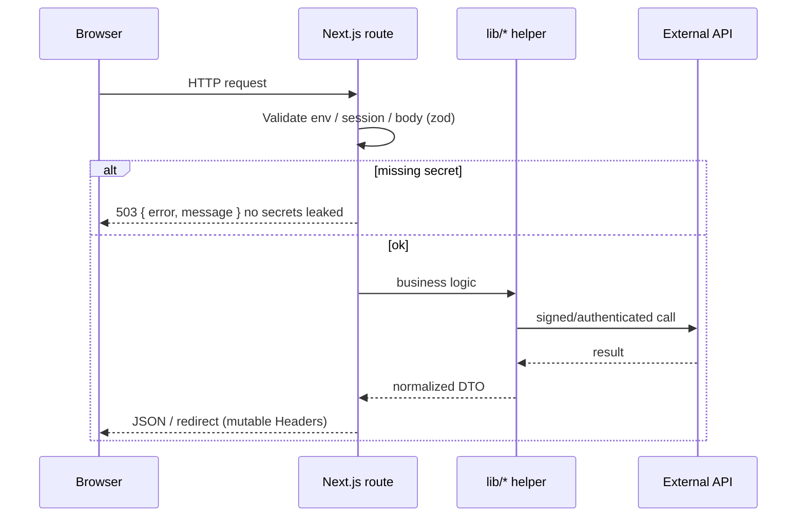

**Critical implementation note:** `Response.redirect()` headers are **immutable** on Vercel/undici. OAuth sets cookies via `lib/http-redirect.ts` (`redirectWithCookies`), not `response.headers.append` on a redirect Response (that caused production 500s).

---

## 6. Maker–checker loop

Conceptual roles (fixed):

| Role | Actor | Tools | May merge? |
|------|--------|-------|------------|
| **Maker** | Gemini agent | `/api/ai/agent`, `/api/loop/iterate`, optional E2B | **No** |
| **Checker** | TestSprite CLI/cloud | Live `APP_URL`, plan files | **No** (only verdicts) |
| **Human** | Collaborator | GitHub merge UI | **Yes** |

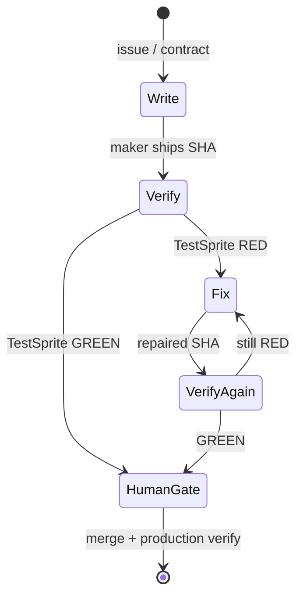

---

## 7. Four-step sequence

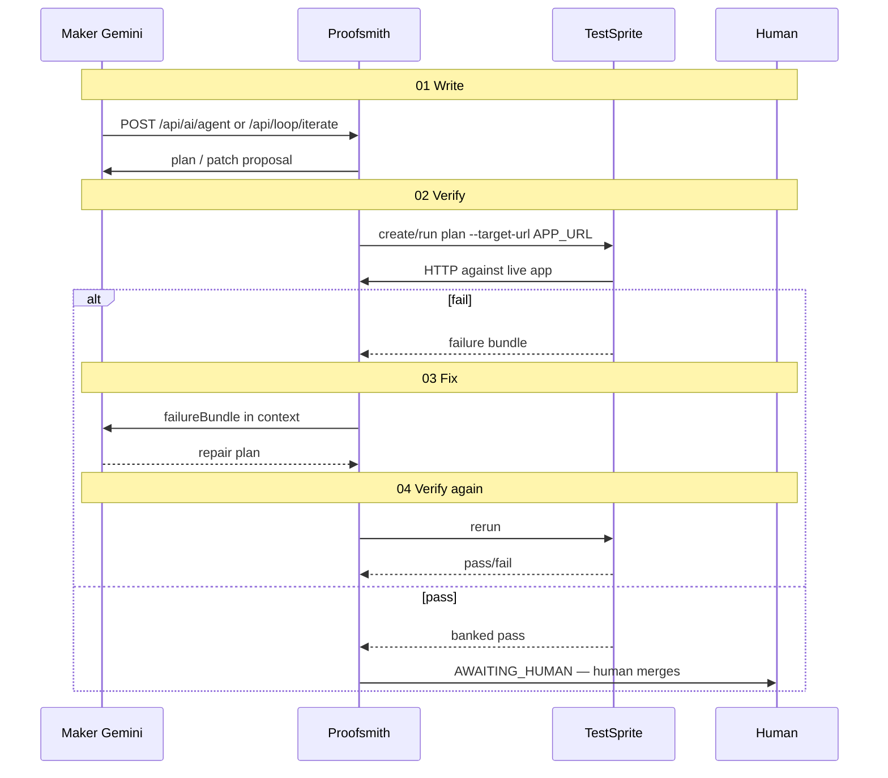

---

## 8. Loop state machine

Source of truth: `packages/loop-state/index.ts`.

### Active states

`DISCOVERED → TRIAGING → CONTRACTED → PLANNING → WORKTREE_READY → BUILDING → LOCAL_RED|LOCAL_GREEN → PREVIEW_* → TESTSPRITE_* → REPAIRING → REVIEW_* → CHALLENGE_* → VERIFIED → AWAITING_HUMAN → MERGED → PRODUCTION_* → MEMORY_BANKED → SUCCESS`

### Terminal states

`SUCCESS · BLOCKED · STALLED · REJECTED · ABORTED · BUDGET_EXHAUSTED · SECURITY_STOP · FAILED`

### Illegal by construction

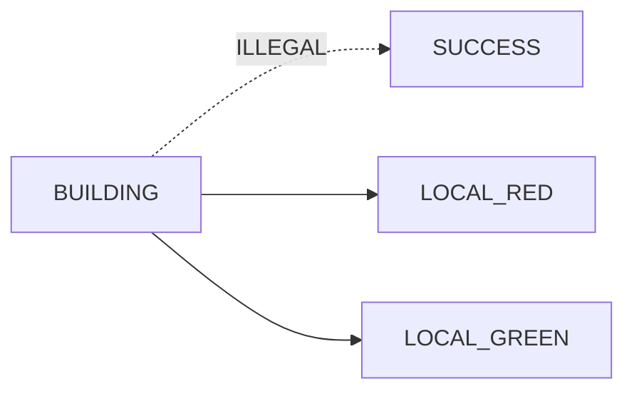

`transition()` throws if `legal[previous]` does not include `next`.

### Happy path (simplified)

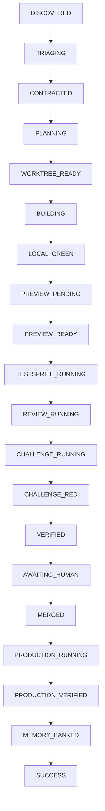

### Repair path

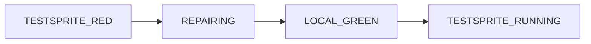

---

## 9. GitHub OAuth sequence

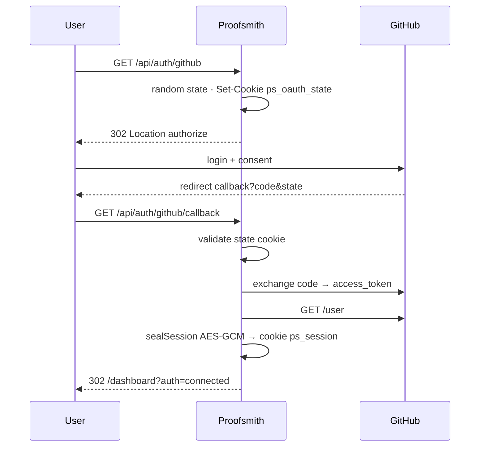

**Env:** `GITHUB_CLIENT_ID`, `GITHUB_CLIENT_SECRET`, `SESSION_SECRET`, `APP_URL`  
**Callback must match:** `{APP_URL}/api/auth/github/callback`

---

## 10. Webhook command pipeline

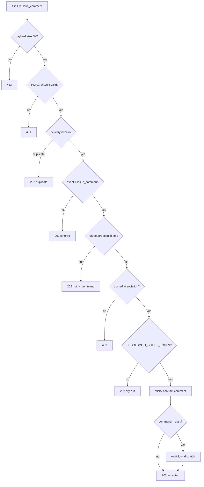

Commands (allowlist): `plan · start · status · verify · repair · review · challenge · explain · replay · pause · resume · stop · resolve-comments · fix-ci · fix-conflicts · release`

---

## 11. Gemini model selection

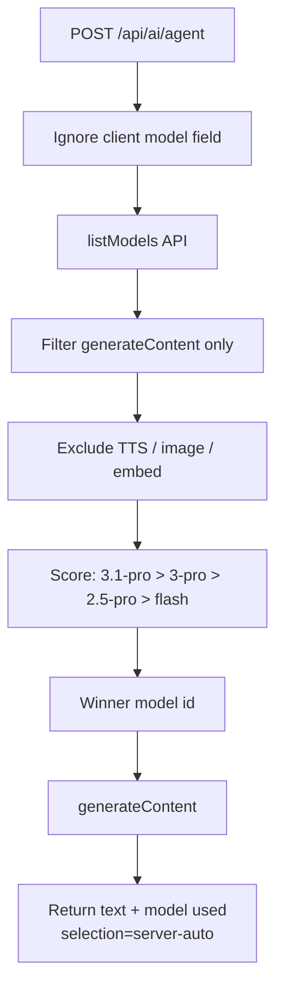

Client **never** receives a full model catalog for shopping. `/api/ai/models` returns readiness + the single selected model only.

---

## 12. TestSprite checker path

```mermaid
flowchart LR
  subgraph Local
    PLAN[.testsprite/plans/*.json]
    CLI[@testsprite/testsprite-cli]
  end
  subgraph Proofsmith
    FAC[/api/testsprite/*]
  end
  subgraph Cloud
    API[api.testsprite.com/api/cli/v1]
    RUN[Browser run vs APP_URL]
  end

  PLAN --> CLI
  CLI --> API
  FAC --> API
  API --> RUN
  RUN -->|pass/fail + artifacts| CLI
  CLI -->|bank| LOOPMD[LOOP.md iteration]
```

Plans in-repo:

| Plan | Intent |
|------|--------|
| `viewer-approval.plan.json` | Viewer cannot approve release |
| `exact-once-deploy.plan.json` | Deploy is exact-once |
| `rollback-audit-focus.plan.json` | Rollback leaves audit trail |

---

## 13. E2B sandbox path

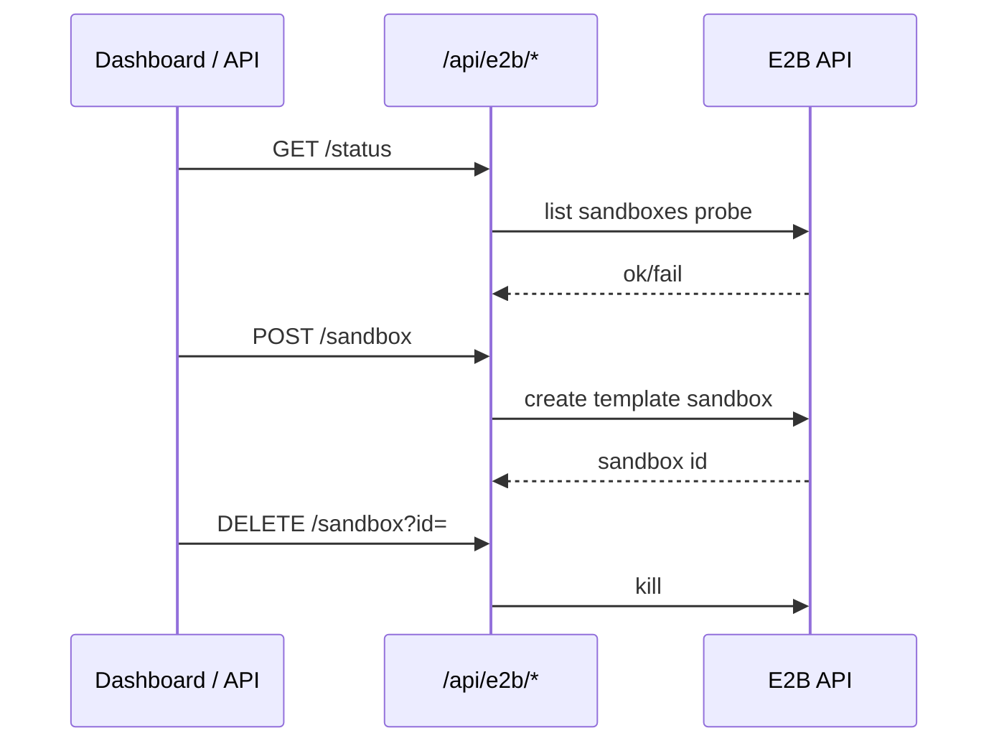

Optional for isolated maker worktrees. Missing key → scorecard still launchable if other critical gates pass.

---

## 14. Agent roster

Defined in `lib/agents-catalog.ts` (all `canApproveMerge: false`).

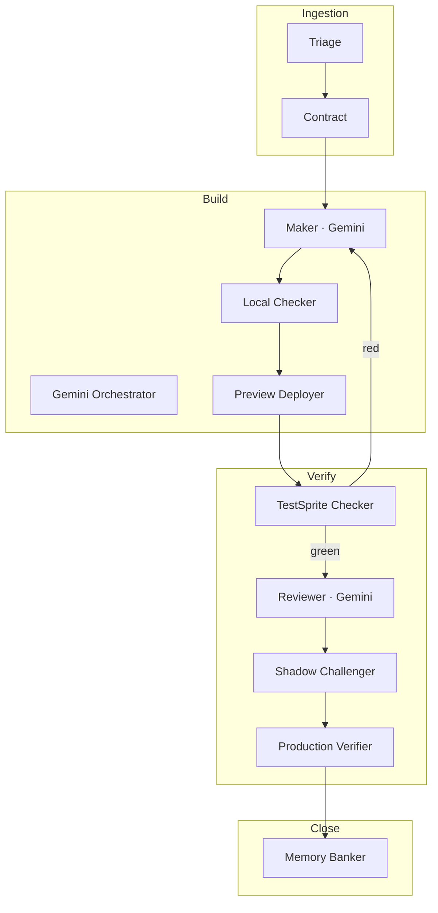

---

## 15. Security boundaries

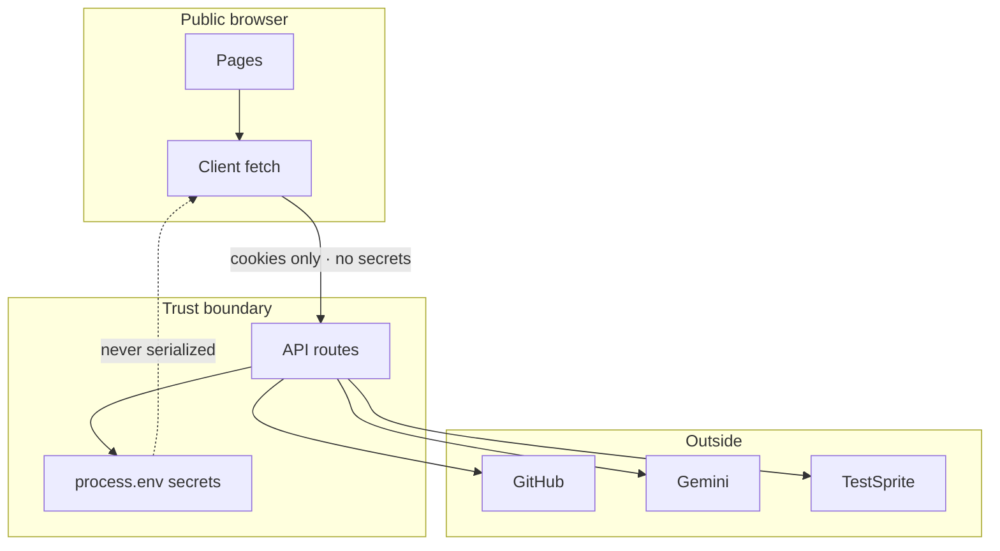

| Control | Location |
|---------|----------|
| Session seal AES-GCM | `lib/github-session.ts` |
| OAuth state CSRF cookie | `ps_oauth_state` |
| Webhook HMAC constant-time | `app/api/github/webhook` |
| Secure cookies on HTTPS | `lib/http-redirect` + cookie helper |
| Scorecard critical gates | `lib/security-scorecard.ts` |

---

## 16. Pre-launch scorecard

```mermaid
flowchart LR
  A[/api/security/scorecard] --> B[Weighted checks]
  B --> C{critical fails?}
  C -->|yes| D[readyToLaunch=false]
  C -->|no + score≥70| E[readyToLaunch=true]
  B --> F[Grade A–F]
```

`/api/launch` aggregates scorecard + Gemini/TestSprite/E2B/GitHub probes for one-click preflight.

---

## 17. Data stores

| Store | Durability | Contents |
|-------|------------|----------|
| Encrypted session cookie | Client, 8h | User + access token |
| `lib/run-store` | Process memory | Demo loop runs |
| GitHub issue comments | GitHub | Sticky loop contracts |
| `LOOP.md` | Git | Agent iteration evidence |
| TestSprite cloud | TestSprite | Runs + artifacts |
| Vercel env | Host | All secrets |

**Not yet:** durable multi-instance run DB (noted as limitation).

---

## 18. API surface map

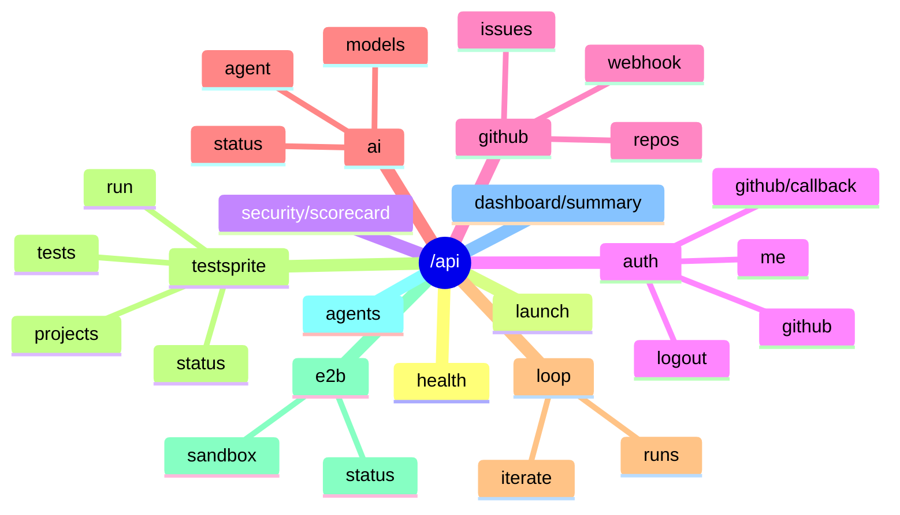

Full field reference: [API.md](./API.md).

---

## 19. Deployment topology

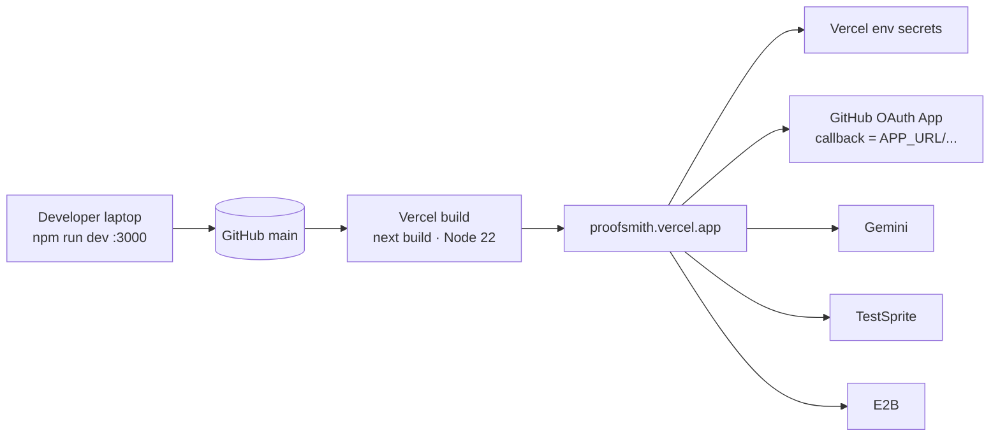

| Concern | Setting |
|---------|---------|
| Framework | Next.js (`vercel.json`) |
| Build | `npm run build` → `next build` |
| Node | `22.x` (`.nvmrc`) |
| Region | `iad1` |

---

## 20. Failure modes

| Symptom | Likely cause | Fix |
|---------|--------------|-----|
| `/api/auth/github` 500 | Immutable redirect + Set-Cookie | Use `redirectWithCookies` (fixed `7e1ac20`) |
| OAuth 503 | Missing CLIENT_ID | Set Vercel env |
| `auth=invalid_state` | Cookie/domain/APP_URL mismatch | Align `APP_URL` + callback |
| `auth=exchange_failed` | Wrong secret / redirect_uri | Match OAuth app config |
| TestSprite red | App bug or brittle plan | Fix code or plan; rerun |
| Scorecard blocked | Critical env missing | `/settings` checklist |
| vinext build fail | Old commit / Sites plugin | Use latest main + `next build` |

---

## 21. Related docs

| Doc | Purpose |
|-----|---------|
| [README.md](../README.md) | A–Z product overview |
| [API.md](./API.md) | Endpoint reference |
| [DEPLOYMENT.md](./DEPLOYMENT.md) | Vercel + OAuth + checker |
| [ENVIRONMENT.md](./ENVIRONMENT.md) | Env var encyclopedia |
| [TESTING.md](./TESTING.md) | Vitest + TestSprite |
| [LOOP.md](../LOOP.md) | Iteration evidence |
| [SUBMISSION.md](../SUBMISSION.md) | Judge pack |
| [SECURITY.md](../SECURITY.md) | Reporting + model |

---

*Architecture is code-backed: if diagrams and `packages/loop-state` diverge, trust the TypeScript.*
